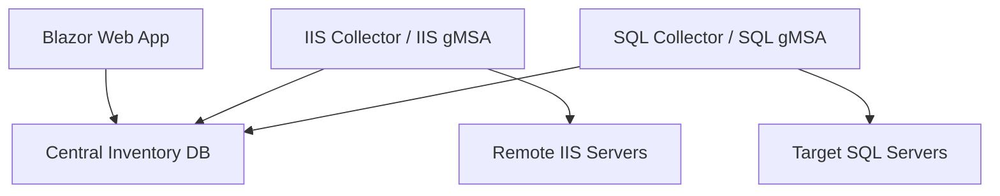

# IIS–SQL Connection Inventory

## Codex Uygulama Geliştirme Dokümanı

**Doküman amacı:** Bu doküman, uygulamanın Codex tarafından uçtan uca geliştirilebilmesi için bağlayıcı teknik gereksinimleri, mimari kararları, veri modelini, güvenlik sınırlarını, iş akışlarını ve kabul kriterlerini tanımlar.

## 1. Projenin amacı

Merkezi bir yönetim sunucusunda çalışacak uygulama aşağıdaki soruya anlık ve tarihsel yanıt verecektir:

> Hangi IIS sunucusundaki hangi Application Pool, hangi SQL Server üzerindeki hangi veritabanına kaç bağlantı açmış; bu bağlantıların kaçı aktif, kaçı idle/pooled durumdadır?

Uygulama:

- Yönetilecek IIS sunucularının Blazor web arayüzünden tanımlanmasını sağlar.
- IIS sunucularına uzaktan bağlanarak Application Pool, worker process ve TCP connection bilgilerini toplar.
- Yalnızca hedef portu `1433` olan SQL bağlantılarını dikkate alır.
- IIS tarafındaki bağlantıları SQL Server DMV session kayıtlarıyla eşleştirir.
- Detay verileri kısa süreli staging alanında tutar.
- Eşleştirme tamamlandıktan sonra yalnızca özet sonucu kalıcılaştırır.
- Başarıyla işlenen staging kayıtlarını hemen siler; sahipsiz veya başarısız kayıtları periyodik temizler.

## 2. Bağlayıcı mimari kararlar

1. Uygulama `.NET 10` ile geliştirilecektir.
2. Merkezi envanter veritabanı `SQL Server 2022` üzerinde olacaktır.
3. Web uygulaması Blazor Web App olacaktır.
4. Web uygulamasında Windows Authentication ve AD grup tabanlı yetkilendirme kullanılacaktır.
5. IIS Collector ve SQL Collector merkezi yönetim sunucusunda çalışan iki ayrı .NET Worker Service olacaktır.
6. Servisler farklı Windows/gMSA hesaplarıyla çalışacaktır.
7. IIS Collector hesabının merkezi envanter veritabanına erişmesine izin verilir.
8. Hedef IIS sunucularına agent kurulmayacaktır.
9. Hedef IIS sunucularında dosya, servis, veritabanı veya kalıcı nesne oluşturulmayacaktır.
10. Hedef uygulama SQL Server'larında hiçbir kalıcı tablo, view, procedure veya job oluşturulmayacaktır.
11. Hedef SQL Server'da yalnızca Collector bağlantısı süresince yaşayan local temporary table (`#IisConnections`) oluşturulabilir. Bu tablo `tempdb` içindedir ve bağlantı kapanınca silinir.
12. Hedef SQL Server'lardaki bütün SQL bağlantıları standart TCP `1433` portunu kullanır. Başka SQL portu desteklenmeyecektir.
13. Kullanıcı parolası, SQL kullanıcı parolası veya gMSA parolası uygulama veritabanında ya da configuration dosyalarında saklanmayacaktır.
14. İlk sürümde kontrol amaçlı gerçek IIS/SQL ortamı bulunmasa bile collector katmanları interface arkasında geliştirilecek ve mock/fake implementasyonlarla test edilecektir.

## 3. Yüksek seviye mimari



### 3.1 Kimlikler

| Bileşen | Örnek hesap | Yetki kapsamı |
|---|---|---|
| Blazor Web App | `DOMAIN\gmsa_InventoryWeb$` | Merkezi DB okuma/yazma |
| IIS Collector | `DOMAIN\gmsa_IisInventory$` | Merkezi DB okuma/yazma ve uzak IIS/network process bilgisi okuma |
| SQL Collector | `DOMAIN\gmsa_SqlInventory$` | Merkezi DB okuma/yazma ve hedef SQL DMV okuma |

Hesap adları konfigüre edilebilir olmalıdır; kod içine gömülmemelidir.

## 4. Çözüm ve proje yapısı

Tek solution altında en az aşağıdaki projeler oluşturulmalıdır:

```text
IisSqlConnectionInventory.sln
src/
  Inventory.Domain/
  Inventory.Application/
  Inventory.Infrastructure/
  Inventory.Contracts/
  Inventory.Web/
  Inventory.IisCollector/
  Inventory.SqlCollector/
tests/
  Inventory.UnitTests/
  Inventory.IntegrationTests/
```

Sorumluluklar:

- `Domain`: Entity, enum ve temel domain kuralları.
- `Application`: Use case, service interface, DTO ve validation.
- `Infrastructure`: EF Core, SQL erişimi, remote IIS ve DMV adapter'ları.
- `Contracts`: Collector'lar arasında kullanılan ortak immutable sözleşmeler.
- `Web`: Blazor UI, Windows Authentication ve yönetim ekranları.
- `IisCollector`: Merkezi Worker Service; uzak IIS toplama.
- `SqlCollector`: Merkezi Worker Service; DMV eşleştirme ve özet üretme.

## 5. Merkezi veri modeli

EF Core migration'ları kullanılacaktır. Aşağıdaki tablolar minimum gereksinimdir.

### 5.1 `IisServers`

| Alan | Tip | Açıklama |
|---|---|---|
| `Id` | int identity PK | IIS sunucu kimliği |
| `ServerName` | nvarchar(128) unique | Görünen NetBIOS adı |
| `Fqdn` | nvarchar(255) nullable | Uzak bağlantı adresi |
| `IsEnabled` | bit | Toplamaya dahil mi |
| `CollectionIntervalSeconds` | int | Varsayılan 60, aralık 10–86400 |
| `ConnectionTimeoutSeconds` | int | Varsayılan 15, aralık 5–300 |
| `Description` | nvarchar(500) nullable | Açıklama |
| `LastCollectionAttemptUtc` | datetime2 nullable | Son deneme |
| `LastSuccessfulCollectionUtc` | datetime2 nullable | Son başarı |
| `LastCollectionStatus` | tinyint nullable | Pending/Running/Success/Failed/Disabled |
| `LastErrorMessage` | nvarchar(2000) nullable | Normalize edilmiş hata |
| `CreatedAtUtc`, `CreatedBy` | audit | Oluşturma bilgisi |
| `UpdatedAtUtc`, `UpdatedBy` | audit | Güncelleme bilgisi |
| `RowVersion` | rowversion | Optimistic concurrency |

Silme varsayılan olarak soft delete/devre dışı bırakma şeklinde uygulanmalıdır.

### 5.2 `SqlServers`

SQL Collector'ın bir IP adresine hangi güvenilir sunucu adıyla bağlanacağını bilmesi gerekir. Reverse DNS tek başına güvenilir kabul edilmeyecektir.

| Alan | Tip | Açıklama |
|---|---|---|
| `Id` | int identity PK | SQL sunucu kimliği |
| `ServerName` | nvarchar(128) | Görünen ad |
| `Fqdn` | nvarchar(255) | TLS/Kerberos için bağlantı adı |
| `IpAddress` | varchar(48) unique | IIS tarafından görülen hedef IP |
| `Port` | int | Daima 1433 |
| `IsEnabled` | bit | Collector erişimi açık mı |
| `TrustServerCertificate` | bit | Varsayılan false; sadece kontrollü test için |
| `ConnectionTimeoutSeconds` | int | Varsayılan 15 |
| `LastConnectionStatus`, `LastErrorMessage` | durum | Son erişim sonucu |
| Audit/RowVersion | | `IisServers` ile aynı yaklaşım |

İlk sürüm web arayüzünde SQL Server yönetim ekranı da bulunmalıdır. IIS Collector bilinmeyen bir SQL IP tespit ederse veri kaybedilmemeli; endpoint `UnknownSqlEndpoint` olarak kayda alınmalı ve yönetim ekranında eşleme bekleyen IP olarak gösterilmelidir.

### 5.3 `CollectionRuns`

Her toplama turunun üst kaydıdır.

| Alan | Açıklama |
|---|---|
| `Id` uniqueidentifier PK | Collection ID |
| `StartedAtUtc`, `CompletedAtUtc` | Zamanlar |
| `Status` | PendingIis, ReadyForSql, ProcessingSql, Completed, Partial, Failed |
| `IisServerCount`, `SuccessfulIisServerCount`, `FailedIisServerCount` | Sayaçlar |
| `StagedConnectionCount`, `MatchedConnectionCount`, `UnmatchedConnectionCount` | Tanı sayaçları |
| `ErrorSummary` | Tur seviyesi hata özeti |

Detay session verisi bu tabloda tutulmaz.

### 5.4 `IisConnectionStaging`

İki servis arasındaki kısa ömürlü aktarım/kuyruk tablosudur; tarihsel detay tablosu değildir.

Minimum alanlar:

```text
Id bigint identity PK
CollectionId uniqueidentifier FK
CollectedAtUtc datetime2(3)
IisServerId int FK
IisServerName nvarchar(128)
AppPoolName nvarchar(256)
WorkerProcessId int
ClientIp varchar(48)
ClientPort int
SqlServerIp varchar(48)
SqlServerPort int (CHECK = 1433)
ProcessingStatus tinyint
ProcessingStartedAtUtc datetime2(3) null
RetryCount int
NextRetryAtUtc datetime2(3) null
LastErrorMessage nvarchar(2000) null
```

İndeks en az `ProcessingStatus, CollectionId, SqlServerIp` alanlarını kapsamalıdır. Bir socket için aynı Collection içinde duplicate kayıt engellenmelidir.

### 5.5 `ConnectionInventory`

Kalıcı tek iş sonucu tablosudur.

```text
Id bigint identity PK
CollectionId uniqueidentifier FK
InventoryDateUtc datetime2(0)
IisServerId int FK
IisServerName nvarchar(128)
AppPoolName nvarchar(256)
SqlServerId int FK
SqlServerName nvarchar(128)
SqlInstance nvarchar(128) null
DatabaseName sysname
SqlEndpoint nvarchar(256)
TotalConnections int
ActiveConnections int
IdlePooledConnections int
WorkerProcessIds nvarchar(1000) null
```

Bağlayıcı kontrol:

```text
TotalConnections = ActiveConnections + IdlePooledConnections
```

Aynı Collection içinde `IisServerId + AppPoolName + SqlServerId + DatabaseName` kombinasyonu unique olmalıdır.

### 5.6 `UnknownSqlEndpoints`

Eşleme yapılamayan hedef SQL IP'lerini özet olarak tutar; connection detayı tutmaz:

```text
IpAddress, Port, FirstSeenUtc, LastSeenUtc, ObservationCount, LastIisServerName
```

### 5.7 `AuditLogs`

IIS/SQL sunucu tanımı ekleme, değiştirme, etkinleştirme ve devre dışı bırakma işlemleri için kullanıcı, zaman, entity, eski değer ve yeni değer kaydedilmelidir.

## 6. IIS Collector gereksinimleri

### 6.1 Sunucu seçimi

Collector her scheduling turunda merkezi DB'den etkin IIS sunucularını okur. Toplama zamanı şu kuralla belirlenir:

```text
LastCollectionAttemptUtc null
veya
LastCollectionAttemptUtc + CollectionIntervalSeconds <= UtcNow
```

Bir sunucu için aynı anda birden fazla toplama çalışmamalıdır. DB tabanlı lease veya atomik status update kullanılmalıdır.

### 6.2 Uzak veri toplama

Uzak bağlantı IIS Collector servis identity'si ile yapılacaktır. İlk tercih PowerShell Remoting/WinRM'dir; implementasyon interface arkasında tutulmalıdır.

Toplanacak bilgiler:

- IIS Application Pool adı.
- Application Pool'a ait aktif `w3wp.exe` PID veya PID'leri.
- Her PID'nin `RemotePort = 1433` olan TCP bağlantıları.
- Local address ve local ephemeral port.
- Remote SQL IP ve port.
- Toplama zamanı.

AppPool-worker process eşleştirmesinde mümkün olduğunda IIS'in resmi yönetim API'si veya güvenilir WMI/CIM bilgisi kullanılmalıdır. Komut çıktısı metin olarak parse edilmemelidir. Bir AppPool'un worker process'i veya port 1433 bağlantısı yoksa staging kaydı oluşturulmaz.

Kontrollü paralellik kullanılmalı, varsayılan `MaxDegreeOfParallelism = 10` olmalıdır. Bir sunucu hatası diğer sunucuların turunu durdurmamalıdır.

### 6.3 Staging yazımı

- Her tur için bir `CollectionRun` oluşturulur.
- Bağlantılar `SqlBulkCopy` ile toplu yazılır.
- Aynı socket duplicate edilmez.
- Tüm IIS işleri bitince run `ReadyForSql` veya kısmi hata varsa işlenebilir `Partial` durumuna alınır.
- IIS'den hiç bağlantı bulunmaması hata değildir; başarılı sıfır sonuçtur.

## 7. SQL Collector gereksinimleri

### 7.1 İş sahiplenme

SQL Collector `ReadyForSql`/işlenebilir run'ları atomik olarak lease eder. `UPDLOCK + READPAST` veya eşdeğer güvenli yaklaşım kullanılmalıdır. Bir run iki kez işlenmemelidir. Süresi geçmiş lease yeniden kuyruğa alınabilmelidir.

### 7.2 SQL Server bazında gruplama

Staging kayıtları `SqlServerIp` bazında gruplanır. IP, etkin `SqlServers` kaydıyla eşleşmiyorsa hedefe bağlanılmaz; `UnknownSqlEndpoints` upsert edilir.

SQL bağlantısı:

- Integrated Security kullanır.
- SQL Server tanımındaki FQDN üzerinden açılır.
- `Encrypt=True` varsayılandır.
- `TrustServerCertificate=False` varsayılandır.
- Hedef DB olarak uygulama veritabanı seçilmez; `master` kullanılabilir.
- SQL metinleri ve secret'lar loglanmaz.

### 7.3 Hedef SQL'deki geçici veri

Her hedef SQL bağlantısı için aynı connection üzerinde:

1. `#IisConnections` oluşturulur.
2. Yalnızca o SQL IP'ye ait staging kayıtları `SqlBulkCopy` ile yüklenir.
3. DMV query aynı açık connection üzerinde çalıştırılır.
4. Sonuç merkezi DB'deki `ConnectionInventory` tablosuna yazılır.
5. Connection kapatılır; temporary table otomatik silinir.

Hedef SQL'de kalıcı nesne oluşturmak kesinlikle yasaktır.

### 7.4 Eşleştirme anahtarı

Bağlantı aşağıdaki tuple ile eşleştirilir:

```text
IIS LocalAddress = sys.dm_exec_connections.client_net_address
IIS LocalPort    = sys.dm_exec_connections.client_tcp_port
SQL RemotePort   = sys.dm_exec_connections.local_tcp_port = 1433
SQL hedef IP     = o anda sorgulanan SqlServers kaydı
```

NAT bulunan ağlarda bu yöntem garanti vermez. İlk sürüm doğrudan routable kurumsal ağ varsayar. Eşleşmeyen kayıtlar detay olarak kalıcılaştırılmaz; yalnızca sayaç ve hata/telemetri olarak tutulur.

### 7.5 Database ve aktiflik

- Aktif session: `sys.dm_exec_requests` içinde session kaydı bulunan connection.
- Idle/pooled session: connection mevcut, fakat `sys.dm_exec_requests` kaydı yok.
- Database ID: aktif request varsa request database ID; aksi halde session database ID.
- Database adı hedef SQL Server üzerinde `DB_NAME(database_id)` ile belirlenir.
- Aynı session birden fazla satır üretse bile `session_id` yalnızca bir connection olarak sayılmalıdır.
- `sys.dm_exec_sessions.status` aktiflik için tek başına kullanılmamalıdır.
- SQL text, query plan, command text ve hassas sorgu verileri toplanmamalıdır.

Özet gruplama:

```text
CollectionId
IisServer
AppPoolName
SqlServer
DatabaseName
```

Hesaplar:

```text
TotalConnections       = distinct eşleşmiş session sayısı
ActiveConnections      = request'i olan distinct session sayısı
IdlePooledConnections  = request'i olmayan distinct session sayısı
```

### 7.6 Tutarlılık ve zamanlama

Socket/session ilişkisi hızlı değişebileceği için SQL işleme IIS snapshot tamamlandıktan hemen sonra başlatılmalıdır. Varsayılan maksimum kabul edilebilir snapshot yaşı 30 saniyedir ve konfigüre edilebilir olmalıdır. Daha eski snapshot `Expired` olarak işaretlenmeli; yanlış eşleşme riskiyle işlenmemelidir.

Özet kayıt yazımı idempotent olmalıdır. Transaction ile özet yazıldıktan sonra ilgili staging kayıtları silinir. İşlem yarıda kalırsa duplicate özet oluşmamalıdır.

## 8. Temizlik ve retention

Arka plan bakım işi veya SQL Agent'a bağımlı olmayan uygulama hosted service aşağıdaki işlemleri yapmalıdır:

- Başarıyla işlenen staging kayıtlarını hemen silmek.
- Varsayılan 10 dakikadan uzun `Processing` kalan lease'leri yeniden kuyruğa almak.
- Varsayılan 24 saatten eski Failed/Expired staging kayıtlarını batch'ler halinde silmek.
- `ConnectionInventory` için varsayılan 30 günlük retention uygulamak.
- Büyük silmeleri örneğin 10.000 satırlık batch'ler halinde yapmak.
- Retention değerlerini configuration'dan okumak.

Detay veriler temizlik süresince dahi UI'da gösterilmeyecektir.

## 9. Blazor web uygulaması

### 9.1 IIS Sunucuları ekranı

Özellikler:

- Listeleme, arama ve durum filtresi.
- Yeni IIS sunucusu ekleme.
- Düzenleme.
- Etkinleştirme/devre dışı bırakma.
- Son deneme, son başarı ve son hata görüntüleme.
- `Bağlantıyı Test Et` komutu.
- `Şimdi Topla` komutu.

`Bağlantıyı Test Et`, web process identity'siyle uzak bağlantı kurmamalıdır. DB'ye bir command/job kaydı bırakmalı ve testi gerçek IIS Collector identity'si çalıştırmalıdır. UI polling veya SignalR ile sonucu göstermelidir.

### 9.2 SQL Sunucuları ekranı

- Sunucu adı, FQDN ve IP/1433 eşlemesi.
- Etkin/pasif durumu.
- Bağlantı testi; testi SQL Collector identity'si yürütür.
- Bilinmeyen SQL endpoint IP'lerini tanımlı sunucuyla eşleme.
- Son bağlantı sonucu ve hata.

### 9.3 Envanter ekranı

Filtreler:

- Zaman aralığı veya son Collection.
- IIS Server.
- Application Pool.
- SQL Server.
- Database.

Kolonlar:

```text
InventoryDate
IisServer
AppPoolName
SqlServer
SqlInstance
DatabaseName
SqlEndpoint
TotalConnections
ActiveConnections
IdlePooledConnections
WorkerProcessIds
```

Varsayılan ekran son başarılı collection sonucunu göstermelidir. Sayfalama server-side yapılmalıdır.

### 9.4 Dashboard

Minimum kartlar:

- Etkin IIS sunucusu sayısı.
- Son tur başarı/başarısızlık sayıları.
- Toplam/aktif/idle connection sayısı.
- Bilinmeyen SQL endpoint sayısı.
- Son başarılı collection zamanı.

## 10. Yetkilendirme

Windows Authentication kullanılacaktır. AD grup adları configuration ile belirlenecektir.

| Rol | Yetki |
|---|---|
| Admin | Sunucu ekleme/düzenleme/devre dışı bırakma, ayarlar |
| Operator | Görüntüleme, test ve şimdi topla |
| Reader | Sadece görüntüleme |

API/Blazor handler seviyesinde authorization policy uygulanmalıdır; yalnızca UI elementlerini gizlemek yeterli değildir.

## 11. Hedef sistem ön koşulları

### IIS sunucuları

- WinRM/PowerShell Remoting erişimi.
- Firewall ve AD/Kerberos yapılandırması.
- IIS Collector gMSA hesabına gerekli minimum remote management, IIS metadata ve process/network connection okuma izinleri.
- Local Administrators üyeliği zorunlu kabul edilmemeli; mümkünse minimum yetki dokümante edilmelidir.

### SQL Server'lar

Hedefte yalnızca Windows login ve DMV okuma yetkisi gerekir. SQL Server 2022 için öncelikle şu minimum izin değerlendirilmelidir:

```sql
CREATE LOGIN [DOMAIN\gmsa_SqlInventory$] FROM WINDOWS;
GRANT VIEW SERVER PERFORMANCE STATE TO [DOMAIN\gmsa_SqlInventory$];
```

Gerçek sorgu setiyle doğrulanmalı; yetersizse gerekçe belgelenmeden geniş izin verilmemelidir. `sysadmin` verilmemelidir.

## 12. Hata yönetimi ve gözlemlenebilirlik

- Structured logging (`Microsoft.Extensions.Logging`) kullanılmalıdır.
- Loglarda correlation/Collection ID bulunmalıdır.
- Event Log ve rolling file provider desteklenmelidir.
- Parola, connection string secret'ı, SQL text veya kullanıcı verisi loglanmamalıdır.
- Bir hedef sunucunun hatası tüm collection'ı durdurmamalıdır.
- DNS, WinRM, access denied, timeout, SQL login, TLS, stale snapshot ve unmatched socket ayrı hata kodlarıyla sınıflandırılmalıdır.
- Health endpoints web uygulamasında bulunmalıdır.
- Servislerin heartbeat bilgisi merkezi DB'de tutulmalı ve UI'da gösterilmelidir.

## 13. Configuration

Minimum ayarlar:

```json
{
  "ConnectionStrings": {
    "InventoryDatabase": "Server=...;Database=...;Integrated Security=True;Encrypt=True;TrustServerCertificate=False"
  },
  "Collectors": {
    "Iis": {
      "SchedulerPollSeconds": 10,
      "MaxDegreeOfParallelism": 10
    },
    "Sql": {
      "SchedulerPollSeconds": 2,
      "MaxSnapshotAgeSeconds": 30,
      "MaxDegreeOfParallelism": 5
    }
  },
  "Retention": {
    "InventoryDays": 30,
    "FailedStagingHours": 24,
    "ProcessingLeaseMinutes": 10,
    "DeleteBatchSize": 10000
  },
  "Authorization": {
    "AdminGroups": [],
    "OperatorGroups": [],
    "ReaderGroups": []
  }
}
```

Ortam özel adlar ve connection string'ler repository'ye gerçek değerleriyle commit edilmemelidir.

## 14. Test edilebilirlik

Aşağıdaki interface'ler veya eşdeğer abstraction'lar bulunmalıdır:

```csharp
public interface IIisRemoteConnectionProvider;
public interface IIisWorkerProcessProvider;
public interface ISqlSessionSnapshotProvider;
public interface ICollectionRunCoordinator;
public interface IInventoryWriter;
public interface ICollectorCommandQueue;
public interface IClock;
```

Unit testlerde doğrulanacak başlıca durumlar:

- PID'nin doğru AppPool'a eşlenmesi.
- Yalnız port 1433 bağlantılarının alınması.
- Client IP + port eşleştirmesi.
- Active/idle sınıflandırması.
- Session tekrarlarının distinct sayılması.
- Bilinmeyen SQL IP davranışı.
- Snapshot expiry.
- Idempotent retry ve duplicate özet engelleme.
- Bir hedef hata verdiğinde diğerlerinin devam etmesi.
- Retention temizliği.
- Authorization policy'leri.

Integration testlerde merkezi SQL Server için Testcontainers kullanılabilir. Windows/IIS ve hedef SQL DMV erişimi abstraction/fake ile test edilmeli; gerçek ortam smoke test scriptleri ayrıca sağlanmalıdır.

## 15. Kurulum çıktıları

Codex aşağıdaki çıktıları üretmelidir:

1. Derlenebilir solution ve tüm source projeleri.
2. EF Core migration'ları.
3. Blazor yönetim ve envanter ekranları.
4. İki Worker Service.
5. Unit ve integration testleri.
6. IIS Collector ve SQL Collector için Windows Service kurulum/kaldırma PowerShell scriptleri.
7. gMSA ve minimum yetki ön koşullarını anlatan deployment dokümanı.
8. Hedef SQL login/permission scripti; hedefte kalıcı uygulama nesnesi oluşturmamalıdır.
9. Merkezi Inventory DB kurulum/migration yönergesi.
10. Mock veriyle lokal demo profili.
11. `README.md`, `ARCHITECTURE.md` ve operasyon/troubleshooting dokümanı.

## 16. Kabul kriterleri

Uygulama tamamlanmış sayılmak için:

1. Blazor UI'dan IIS ve SQL sunucusu eklenebilmeli, düzenlenebilmeli ve devre dışı bırakılabilmelidir.
2. IIS Collector etkin IIS listesini merkezi DB'den okuyup farklı IIS credential gMSA'sı ile uzaktan toplama yapmalıdır.
3. SQL Collector farklı SQL gMSA'sı ile hedef SQL Server'lara bağlanmalıdır.
4. `IIS IP + local port + SQL endpoint` üzerinden Application Pool ile SQL session doğru eşleşmelidir.
5. Sonuç IIS Server + AppPool + SQL Server + Database bazında özetlenmelidir.
6. Total, Active ve Idle değerleri doğru olmalı ve toplam kontrolü sağlanmalıdır.
7. Hedef sistemlerde hiçbir kalıcı uygulama nesnesi oluşturulmamalıdır.
8. Hedef SQL'deki `#IisConnections` connection kapanınca yok olmalıdır.
9. Başarılı run sonrasında ilgili staging detayları silinmelidir.
10. Retry halinde duplicate kalıcı özet oluşmamalıdır.
11. Başarısız tek bir IIS/SQL hedefi diğer hedeflerin sonucunu engellememelidir.
12. UI son run, geçmiş sonuçlar, durumlar ve normalize hataları gösterebilmelidir.
13. Tüm otomatik testler geçmeli; build warning'leri mümkün olduğunca sıfır olmalıdır.

## 17. Codex için geliştirme sırası

Codex aşağıdaki sırayla ilerlemelidir:

1. Repository ve varsa mevcut `AGENTS.md`/handoff dokümanlarını incele.
2. Solution iskeleti, domain ve veri modelini oluştur.
3. EF Core migration ve merkezi DB repository'lerini tamamla.
4. Fake IIS ve fake SQL snapshot provider ile collection orchestration'ı geliştir.
5. Özetleme, idempotency ve cleanup testlerini tamamla.
6. Blazor yönetim ve sonuç ekranlarını oluştur.
7. Gerçek uzak IIS adapter'ını geliştir.
8. Gerçek SQL DMV adapter'ını ve temporary-table/bulk-copy akışını geliştir.
9. Windows Authentication, authorization ve audit'i ekle.
10. Windows Service packaging, deployment ve smoke test araçlarını tamamla.

Her aşamada build ve ilgili testler çalıştırılmalıdır. Gerçek hedef sunuculara bağlanma, yetki verme veya deployment işlemi kullanıcı açıkça onaylamadan yapılmamalıdır.

## 18. Kapsam dışı

İlk sürümde aşağıdakiler kapsam dışıdır:

- 1433 dışındaki SQL portları.
- SQL Authentication parola yönetimi.
- NAT arkasındaki bağlantı korelasyonu.
- Linux tabanlı web/SQL hedefleri.
- Query text veya execution plan toplama.
- IIS/SQL üzerinde start, stop, kill veya configuration değiştirme.
- Hedef sunuculara agent kurulumu.
- Hedef uygulama SQL Server'larında kalıcı schema değişikliği.

